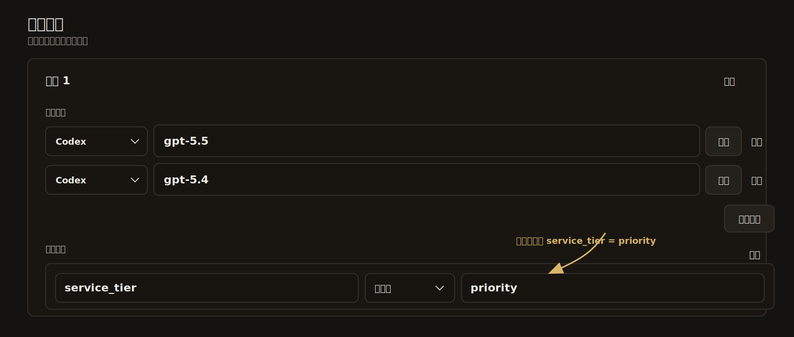

# Codex Windows Fast Patch Skill

语言：[中文](README.md) | [English](README.en.md)

这是 `codex-windows-fast-patch` skill 的公开版本，用于指导智能体在 Windows 上恢复 Codex Desktop 升级后失效的本地补丁和能力开关。

## 主要功能

- 在 Codex Desktop 升级后重新应用 Windows MSIX 补丁。
- 验证 Fast Mode 请求是否真的带上 `service_tier=priority`。
- 注册和修复本地插件市场配置。
- 修复本地插件市场清单目录结构。
- 刷新 Windows Computer Use 兼容文件。
- 解除 Computer Control 页面里 `Any App` / `任意应用` 被组织或地区门控禁用的问题。
- 恢复 Codex Desktop 中文界面资源和 i18n 开关，避免升级后菜单、控件回退到英文。
- 给本地会话侧边栏补上“删除对话”，在只有“归档”的版本里增加永久删除入口和确认提示。
- 重新开启 Goal / 目标相关入口等升级后可能被门控隐藏的桌面端能力。

## 平台支持

当前只支持 Windows。

这个 skill 依赖 Windows Store / MSIX 包结构、PowerShell、`Get-AppxPackage`、`makeappx.exe`、`signtool.exe`、Windows 用户环境变量，以及 Windows Computer Use helper 路径。

不要在 macOS 上直接运行。macOS 需要单独的实现流程，例如处理 Codex `.app` 包、ASAR 解包和重打包、`codesign` 或 quarantine、shell 脚本，以及 macOS 自己的 Computer Use 可用性门控。

## 文件说明

- `SKILL.md`：Agent skill 主说明。
- `MAINTENANCE.md`：给后续会话使用的维护说明、更新规则和最近脚本整合记录。
- `agents/openai.yaml`：agent 配置。
- `scripts/repatch-codex-windows.ps1`：工作流参考脚本。
- `scripts/patch_codex_fast_mode_windows_msix.ps1`：MSIX / ASAR 补丁参考实现。
- `scripts/install-patched-msix.ps1`：为已构建好的 patched MSIX 执行证书信任和安装的辅助脚本。
- `scripts/install-computer-use-local.ps1`：Windows Computer Use 本地兼容文件安装和校验参考实现。

## 安装

先克隆仓库，然后在仓库根目录打开 PowerShell，只复制 skill 需要的文件：

```powershell
$source = (Get-Location).ProviderPath
if (-not (Test-Path -LiteralPath (Join-Path $source 'SKILL.md'))) {
  throw '请在 codex-windows-fast-patch-skill 仓库根目录运行此命令。'
}

$dest = Join-Path $env:USERPROFILE '.codex\skills\codex-windows-fast-patch'
New-Item -ItemType Directory -Force -Path $dest | Out-Null

Copy-Item -Force -LiteralPath (Join-Path $source 'SKILL.md') -Destination $dest
Copy-Item -Force -LiteralPath (Join-Path $source 'MAINTENANCE.md') -Destination $dest
Copy-Item -Recurse -Force -LiteralPath (Join-Path $source 'agents') -Destination $dest
Copy-Item -Recurse -Force -LiteralPath (Join-Path $source 'scripts') -Destination $dest
```

安装到 Codex 后，重启 Codex，让它重新加载 skill 元数据。

## 使用方式

安装后，让支持 Agent Skills 的智能体使用 `$codex-windows-fast-patch` 处理当前机器上的 Codex Desktop 问题。这个 skill 适合在 Codex Desktop 升级、重装、功能消失、界面语言回退、Computer Use 不可用、插件市场异常、Fast Mode 不确定是否生效时调用。

推荐直接这样问：

```text
使用 $codex-windows-fast-patch，检查并修复这台 Windows 机器上的 Codex Desktop。重点恢复 Fast Mode、插件市场、Goal、Windows Computer Use、中文界面，以及会话侧边栏的删除对话功能。
```

也可以按问题更具体地触发：

```text
使用 $codex-windows-fast-patch，验证我的 Fast Mode 请求是否真的发送了 service_tier=priority。
```

```text
使用 $codex-windows-fast-patch，修复 Codex Desktop 里 Any App / 任意应用 被组织或地区门控禁用的问题。
```

```text
使用 $codex-windows-fast-patch，恢复 Codex Desktop 中文界面，并给本地会话菜单补上删除对话。
```

这些脚本是参考实现和操作模板，不是跨所有机器都能无脑运行的一键方案。实际处理时应先读取 `SKILL.md`，检查当前机器的 Codex 安装方式、MSIX 包路径、ASAR 内容、签名工具、插件目录、语言资源、会话菜单目标文件和 Computer Use 文件状态，再决定执行、改写或只借鉴其中的步骤。

通常流程是：先跑 `-DryRun` 确认补丁目标都能找到，再执行完整修复；修复完成后重启 Codex Desktop，并验证 Fast Mode、中文界面、插件列表、Computer Use、Goal 入口和“删除对话”菜单是否都存在。

## 辅助脚本

如果已经构建好了 patched MSIX，但不想重新跑完整 repack 流程，可以直接使用这个安装辅助脚本：

```powershell
powershell -NoProfile -ExecutionPolicy Bypass -File "$env:USERPROFILE\.codex\skills\codex-windows-fast-patch\scripts\install-patched-msix.ps1" -MsixPath "C:\Users\you\Downloads\codex-msix-repack\OpenAI.Codex_xxx\artifacts\OpenAI.Codex_xxx_patched.msix"
```

这个 helper 会优先按 publisher 自动寻找本地证书；如果你已经知道签名证书，也可以显式传入 `-CertThumbprint <thumbprint>`。它还支持 `-StatusPath <path>` 用来写入带时间戳的进度日志，以及 `-NoLaunch` 用来在安装后不立即启动 Codex Desktop。

`scripts/patch_codex_fast_mode_windows_msix.ps1` 里的 Fast Mode 校验逻辑现在也已经增强：它会同时尝试 `model_providers.OpenAI.base_url` 和 `openai_base_url`，同时捕获 WebSocket frame 和 HTTP request body，在探测时禁用 plugins 和 apps，并为每次尝试保存 Codex CLI 输出；如果校验失败，会自动保留 capture 目录供后续排查。

## CPA 上游配置

如果 Codex 请求的上游是 CPA，仅在本地把请求改成 `service_tier=priority` 还不够。还需要在 CPA 的覆盖规则中，对承接 Codex 的模型强制覆盖参数：`service_tier`、类型为字符串、值为 `priority`，这样上游才会真正按 Fast / Priority 路径处理。

图中的模型名只是示例，实际应按 CPA 中当前承接 Codex 的模型填写。



## 致谢

感谢原作者 [chen0416ccc-cpu/codex-windows-fast-patch-skill](https://github.com/chen0416ccc-cpu/codex-windows-fast-patch-skill) 的公开工作，也感谢 [LinuxDo community](https://linux.do/) 中相关讨论和反馈对这个工作流的启发。
